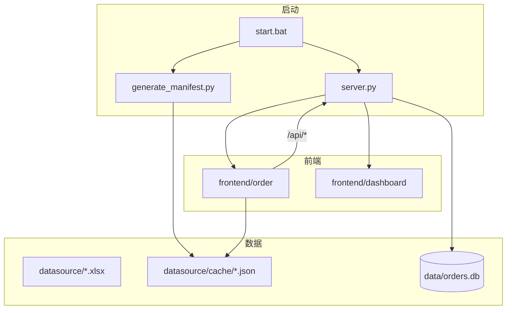

# 项目总览

> 最后更新：2026-07-03

## 项目简介

IntelliOrder 面向零售/服装行业的数据分析与业务操作，采用前后端分离目录组织：

| 模块 | 说明 |
|------|------|
| **frontend/order**（智能订货系统） | 基于 Excel 订货数据，提供年度对比概览、历史销售查询、智能尺码推荐、订货单管理与 SQLite 持久化。 |
| **frontend/dashboard**（店铺业绩监看大屏） | 数据可视化大屏，展示店铺业绩排名、完成率分布、同比对比等 KPI（当前 Mock 数据）。 |
| **backend** | Python HTTP 服务、Excel 转 JSON 缓存、SQLite 订货 API。 |

---

## 目录结构

```
IntelliOrder/
├── backend/                    # 后端（仅 Python）
│   ├── main.py                 # EXE 打包入口
│   ├── server.py               # HTTP 静态服务 + REST API
│   └── generate_manifest.py    # Excel → JSON 缓存
├── frontend/                   # 前端（HTML / CSS / JS）
│   ├── order/                  # 智能订货系统
│   │   ├── index.html
│   │   ├── css/
│   │   └── js/
│   └── dashboard/              # 业绩监看大屏
│       ├── index.html
│       ├── css/
│       └── js/
├── datasource/                 # Excel 数据源 + JSON 缓存 + 商品图片
│   ├── *.xlsx
│   ├── cache/*.json
│   ├── manifest.json
│   └── PIC/
├── data/                       # SQLite 订货库（运行时生成）
├── docs/ai/
├── start.bat                   # 开发启动
└── build.bat                   # PyInstaller 打包
```

---

## 运行方式

**前置条件：** Python 3 已安装并加入 PATH。

```bat
start.bat
```

启动流程：

1. 释放端口 `8765`
2. 运行 `backend/generate_manifest.py` 生成 JSON 缓存
3. 启动 `backend/server.py` 并打开浏览器

| 地址 | 应用 |
|------|------|
| `http://127.0.0.1:8765/` | 智能订货系统 |
| `http://127.0.0.1:8765/dashboard/` | 业绩监看大屏 |

环境变量：`PORT`（默认 8765）、`HOST`（默认 127.0.0.1）

> 直接打开 `frontend/order/index.html` 无法使用订货 API（`/api/orders`），必须通过 `start.bat` 启动后端。

---

## 技术栈

| 层级 | 技术 |
|------|------|
| 前端 | HTML5、CSS3、原生 JavaScript（ES Module） |
| 后端 | Python 3 标准库（`http.server`、`sqlite3`） |
| 数据 | SQLite（`data/orders.db`）、JSON 缓存（`datasource/cache/`） |
| 图表（大屏） | ECharts 5.5.0（CDN） |
| 打包 | PyInstaller（`build.bat`） |

**Python 依赖：** 标准库 + `openpyxl`（Excel 转 JSON，推荐安装）

---

## 后端 API

| 方法 | 路径 | 说明 |
|------|------|------|
| GET | `/api/orders` | 列出全部订货单 |
| PUT | `/api/orders` | 新增/更新订货单 |
| DELETE | `/api/orders/{id}` | 删除单条 |
| DELETE | `/api/orders` | 清空全部 |
| POST | `/api/orders/migrate` | localStorage → SQLite 迁移 |
| GET | `/api/product-images` | 商品图片索引 |

---

## 架构



**路由规则（server.py）：**

- `/`、`/css/`、`/js/` → `frontend/order/`
- `/dashboard/` → `frontend/dashboard/`
- `/datasource/` → 项目根 `datasource/`（外部可编辑）
- `/api/` → REST API
